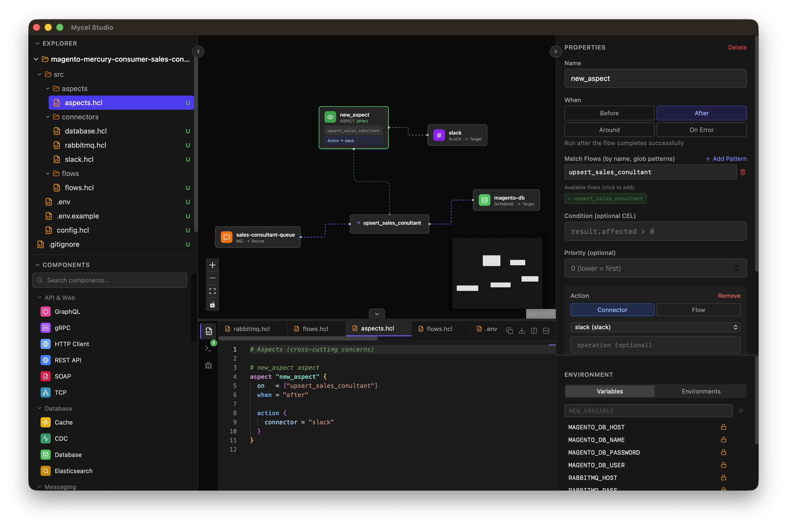

<div align="center">

<h1>Mycel Studio</h1>

<p><strong>Visual editor for <a href="https://github.com/matutetandil/mycel">Mycel</a> microservice configurations</strong></p>

<p>Design data pipelines visually, generate production-ready HCL, and debug in real time.</p>

[](CONTRIBUTING.md)
[](https://buymeacoffee.com/matutetandil)

</div>

---

## Table of Contents

- [Overview](#overview)
- [Getting Started](#getting-started)
- [Features](#features)
- [Scope](#scope)
- [Architecture](#architecture)
- [Contributing](#contributing)
- [Feedback](#feedback)
- [Documentation](#documentation)
- [License](#license)

## Overview

Mycel Studio is a desktop and web IDE for creating [Mycel](https://github.com/matutetandil/mycel) microservice configurations. Instead of writing [HCL2](https://github.com/hashicorp/hcl) by hand, you drag connectors and flows onto a canvas, wire them together, and Studio generates the configuration files.

It ships as a **native macOS app** (via [Wails](https://wails.io/)) and as a **Docker image** for browser-based editing.

<div align="center"></div>

## Getting Started

- **macOS / Linux (one-liner)**
  ```bash
  curl -fsSL https://raw.githubusercontent.com/matutetandil/mycel-studio/main/install.sh | bash
  ```
  On macOS this installs the `.app` to `~/Applications` and removes the quarantine flag automatically.

- **Download binaries** &mdash; Grab the latest build for your platform from [Releases](https://github.com/matutetandil/mycel-studio/releases).

- **Docker (browser)** &mdash; Run the web version in a container:
  ```bash
  docker compose up --build
  # Open http://localhost:8080
  ```

- **Build from source**
  ```bash
  # Desktop app
  make build
  open build/bin/MycelStudio.app   # macOS

  # Development (hot-reload)
  make dev
  ```

## Features

### Visual Canvas

- Drag-and-drop **26 connector types** and **flow nodes** onto a React Flow canvas
- Auto-create flows when connecting two connectors
- Source fan-out visualization when multiple flows share a connector
- Undo/redo, copy/paste, duplicate, keyboard shortcuts

### Connectors (26 types)

| Category | Types |
|----------|-------|
| API & Web | REST, HTTP, gRPC, GraphQL, TCP, SOAP |
| Database | Database (SQLite/Postgres/MySQL/MongoDB), Cache, CDC, Elasticsearch |
| Messaging | MQ (RabbitMQ/Kafka/Redis), MQTT |
| Real-time | WebSocket, SSE |
| Storage | File, S3, FTP/SFTP, PDF |
| Execution | Exec |
| Integration | OAuth, Webhook |
| Notifications | Email, Slack, Discord, SMS, Push |

Each connector has a full configuration UI with driver-specific fields, TLS, connection pooling, retry, and CORS options.

### Flow Blocks (12 types)

| Block | Purpose |
|-------|---------|
| Transform | CEL expression field mappings |
| Step | External data enrichment from other connectors |
| Response | Output reshaping with `input.*` / `output.*` variables |
| Validate | Input/output type checking |
| Cache | Per-flow caching with TTL |
| Lock | Distributed mutex |
| Semaphore | Concurrency limiting |
| Dedupe | Event deduplication |
| Batch | ETL-style chunk processing |
| Error Handling | Retry, fallback/DLQ, error response |
| Idempotency | Storage-backed idempotency keys |
| Async | Asynchronous execution with status tracking |

### Enterprise Features

- **Sagas** &mdash; Distributed transactions with action/compensate pairs, delay, await
- **State Machines** &mdash; Entity lifecycle with states, transitions, guards, actions
- **Auth Configuration** &mdash; JWT, password policy, MFA, sessions, social login presets
- **Security** &mdash; Input sanitization limits, WASM sanitizers
- **Plugins** &mdash; Git-sourced WASM plugins with semver
- **Environment Variables** &mdash; Auto-scan `env()` references, per-environment overlays
- **Connector Profiles** &mdash; Multiple backends with CEL-based selection and fallback

### Monaco IDE

- HCL2 syntax highlighting with custom Monarch tokenizer
- Context-aware autocompletion (blocks, attributes, connector names, CEL functions)
- Hover documentation for keywords, functions, and variables
- Real-time client-side validation with error markers
- Multi-file tabbed editor with split view
- Breakpoint support with JetBrains-style line number overlays

### HCL Generation

- Multi-file output following Mycel project structure (`config.hcl`, `connectors/`, `flows/`, `types/`, etc.)
- File-as-source-of-truth &mdash; existing HCL files are never overwritten
- Backend validation via Go HCL parser (syntax, structure, semantic checks)

## Scope

Mycel Studio aims to:

- Provide a visual alternative to hand-writing Mycel HCL configurations
- Support the full Mycel feature set (connectors, flows, types, validators, transforms, aspects, sagas, state machines)
- Generate valid, production-ready HCL2 that the Mycel runtime can execute
- Work as both a native desktop IDE and a browser-based editor

Read the [Roadmap](ROADMAP.md) for planned features and the [Changelog](CHANGELOG.md) for version history.

## Architecture

Mycel Studio is a **dual-mode application**:

| Mode | Entry Point | Frontend | Backend |
|------|-------------|----------|---------|
| Desktop (Wails) | `main.go` | Embedded via `//go:embed` | Go bindings over IPC |
| Docker (HTTP) | `cmd/server/main.go` | Static files | Go HTTP server |

Both modes share the same Go packages (`parser/`, `handlers/`, `models/`) and the same React frontend.

```
mycel-studio/
├── main.go                  # Wails desktop entry point
├── app.go                   # Wails bindings (parse, generate, validate)
├── fs.go                    # Native filesystem operations
├── git.go                   # Native git integration
├── menu.go                  # macOS application menu
├── debug.go                 # Debug/DAP support
├── cmd/server/              # Docker HTTP server entry point
├── parser/                  # HCL parser (hashicorp/hcl/v2)
├── handlers/                # HTTP/IPC handlers
├── models/                  # Data models
├── frontend/
│   └── src/
│       ├── components/      # React components (Canvas, Nodes, Properties, etc.)
│       ├── connectors/      # Connector registry (26 definitions)
│       ├── flow-blocks/     # Flow block registry (12 definitions)
│       ├── validators/      # Validator registry (3 definitions)
│       ├── monaco/          # HCL language support for Monaco
│       ├── stores/          # Zustand state management
│       ├── hooks/           # React hooks
│       └── lib/             # File system abstraction, git, API layer
├── Dockerfile
└── docker-compose.yml
```

### Tech Stack

- **Frontend:** React 18, TypeScript, React Flow, Tailwind CSS, Monaco Editor, Zustand
- **Backend:** Go, Wails v2
- **Build:** Vite
- **Deployment:** Wails (macOS), Docker (web)

## Contributing

Read below how to join the project, propose new features, and improve the codebase.

- Start by reading the [Roadmap](ROADMAP.md) to understand what's planned
- Look for issues labeled [`good first issue`](https://github.com/matutetandil/mycel-studio/labels/good%20first%20issue) if you're new to the project
- PRs are welcome for bug fixes, new connector definitions, and documentation

## Feedback

- **Report bugs** via [GitHub Issues](https://github.com/matutetandil/mycel-studio/issues)
- **Propose features** by opening a [Discussion](https://github.com/matutetandil/mycel-studio/discussions)
- **Support the project** at [Buy Me a Coffee](https://buymeacoffee.com/matutetandil)

## Documentation

- [Mycel Runtime Documentation](https://github.com/matutetandil/mycel) &mdash; HCL syntax, connectors, flows
- [Changelog](CHANGELOG.md) &mdash; Version history
- [Roadmap](ROADMAP.md) &mdash; Planned features and known gaps

## License

- [EPL-2.0 OR GPL-2.0-only WITH Classpath-exception-2.0](LICENSE)
